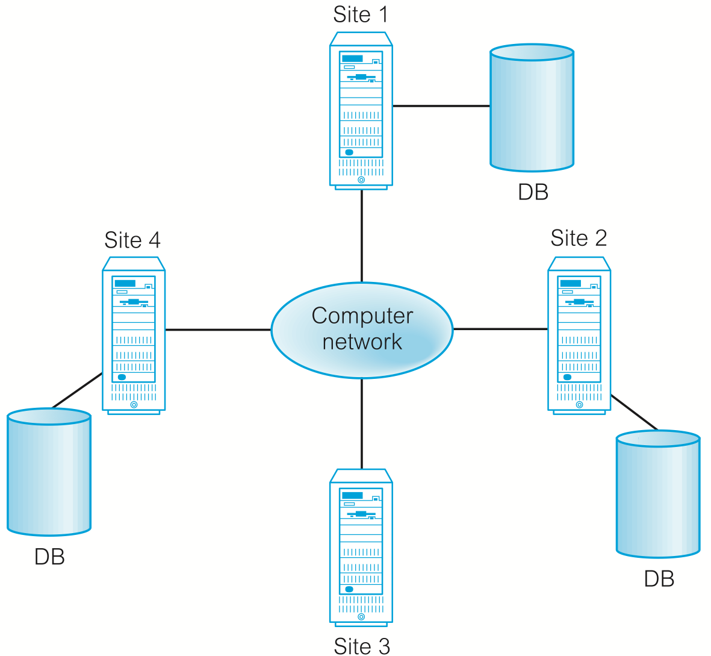

# Lecture 1 :

## Disributed Databae
- A logically interconnected set of shared data (and a description of this data) physically scattered over a computer network.

## DDBMS 
-  This software system allows the management of the distributed database and makes the distribution transparent to users . 

- A Distributed Database Management System (DDBMS) contains a __single logical database__ that is divided into a __number of fragments__. Every fragment gets stored on one or more computers under the control of a __separate DBMS__, with the computers connected by a communications network.|

## DDBMS characteristics:

* a collection of logically related shared data
*  the data is split into a number of fragments
* fragments may be replicated
* fragments/replicas are allocated to sites
* the sites are linked by a communications network
* the data at each site is under the control of a DBMS
* the DBMS at each site can handle local applications, autonomously
* each DBMS participates in at least one global application
---
## Transparency

- It refers to the separation of the high-level semantics of a
system from lower-level implementation issues. In a
distributed system, it hides the implementation details from
users of the system.

### Distribution transparency can be classified into:

- Fragmentation transparency
  > It __hides the fact from users__ that the data are fragmented.

  > __Users are not required to know__ how a relation has been
fragmented.
  >  __To retrieve data__, the user needs not to specify
the particular fragment names.
- Location transparency
   > Users are not required to know the __physical location___ of the
data.

  >  To retrieve data from a distributed database with
location transparency, the user has to specify the database
__fragment names__ but need __not__ to specify __where__ the fragments
are located in the system.
- Replication transparency
  > The user is __unaware of the fact__ that the fragments of
relations are __replicated and stored__ in __different sites__ of the
system.
- Local mapping transparency
  > It refers to the fact that users are __aware of both the fragment names and the location of fragments,__ taking into account that any replication of the fragments may exist. In this case, the user has to __mention both the fragment names and the location for data access.__
- Naming transparency
  > In a distributed database system, each database object such
as- relations, fragments, replicas etc, must have a unique
name. Therefore, the DDBMS must ensure that no two sites
create a database object with the same name.