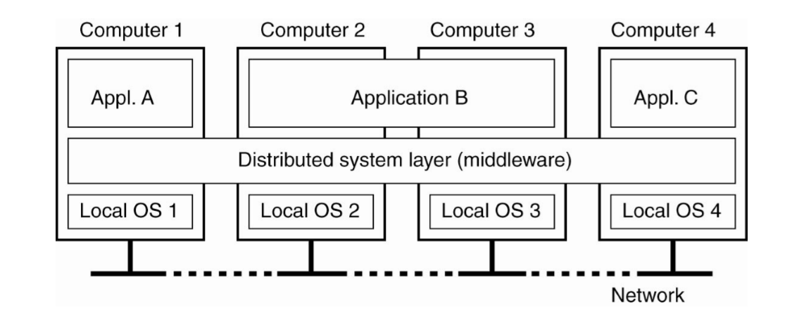
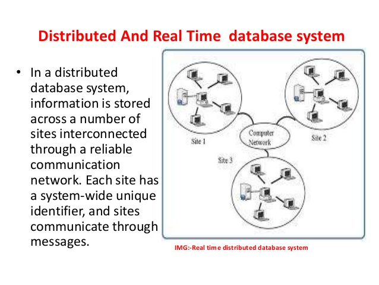
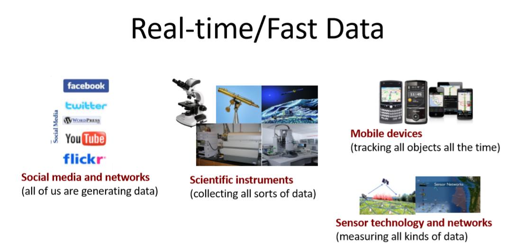
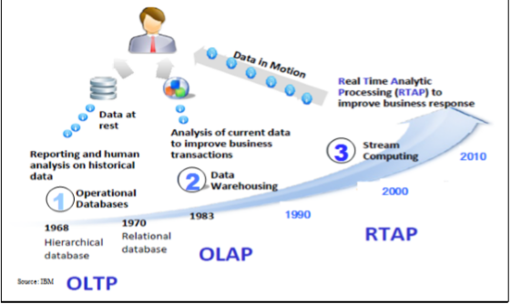
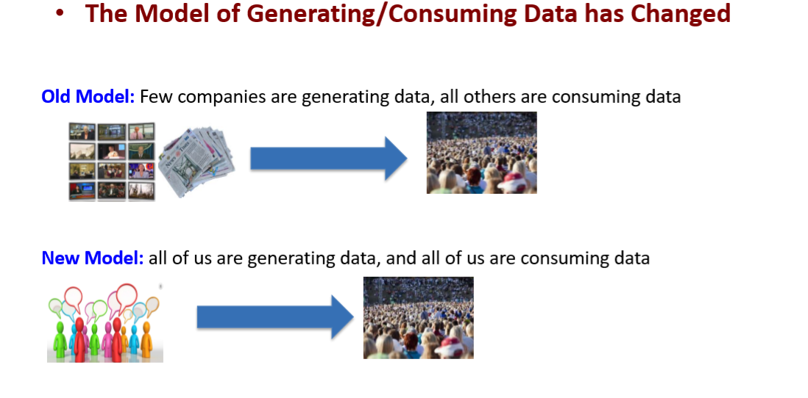
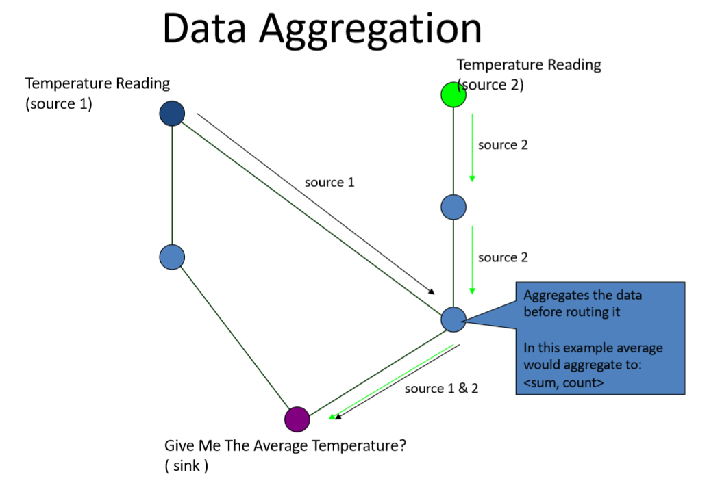

# In The Name of Allah 

## The Final Exam In Shaa AllAH 
 Dr Mohammad El-Hosieny ordered that Final Exam Contain only the 7 chapters 


|Slides|
|:--:|
| Intro To DBMS|
| Transparency |
|DDB Design|
| Concurrency Control|
| DDB Security|
| Real time DB |
| Big Data |


# Some of Studies & Contributions

# Intro To DDB
---
## Distributed Systems:
> A __distributed system__ is: A collection of __independent computers__ that appears to its users as a __single coherent system__.


> If you really need to know about the Generation of Distributed Systems:

 - Databased Architictures
      - Distributed DB
 - Software Based
    - RPC, gRPC => Microsoft Blazor Engine
    - REST Softwares (GET , POST , Delete ,PUT) HTTP Based Methods=> Dotnet APIS
    - CORBA (Broker Based)
  - Process Based
     - SOA (Coarse Grained Services) WSDL(SOAP/HTTP) => Microsoft WCF
     - Microservice Architecture (Fine Grained Services) => Dotnet MCS (The Best Choice in Real world Enterprise Challenges)

> In Distributed System the Distribution must be Transparent from users to solve the complexity and Security so let's discover the Transparency models :
> 

## Distributed Database

 > It is a system to process a __Unit of execution__ (a transaction)in a distributed manner.

 > That is, a __transaction__ can be executed by __multiple networked computers__ in a __unified manner__.

 > __A distributed database (DDB)__ is a collection of multiple __logically interrelated databases__ distributed over a computer network 
 
 > __distributed database management system__(DDBMS) a software system that manages a distributed database while making the distribution transparent to the user.

## So DDBS = DDB + DDBMS

## The Concurrency control Methods for DDB (The Distributed Environment ):-

- Locking (Pessimistic approach )
  - Majority
  - Biased (Shared Read/ Exclusive Write Locks)
  - 2 Phase Locking
- The Timestamp Ordering
- The Optimistic Approach
- Hybrid

## Majority 

> Local lock manager at each site administrates lock and unlock requests for data item stored at that site.


### UnReplicated data:

- Let (S) to be the site where data item (Q) are to be used for Read or Write

- When Transaction T need to lock the Q it sends to S (The Lock manager)

- If Q is locked in an incompatible mode, then the request is delayed until it can be granted.
- if Q can be granted, the local manager sends a message back to lock the item .

### Replicated Data:

- Q = Replicated item  , n the sites contain Q
- The Request must be sent to more half of the sites contain Q (The Request Messages >= 1/2 N)
- The T can not obtain Q until the majority of N grant the lock
- When Read , from one site -- When Write , performing Writes in all of the N.

### Benefits 
> It Can be used when some sites are unavailable

### Drawbacks
> Requires __2(n/2+1)__ messages for handling the __locks__ and __(n/2+1)__ to handle __unlocks__

> Potential for __Deadlock__ even with single item , each 3 transactions can have locks on 1->3 rd of the replicas of a data


## Biased Protocol


# Real Time Distributed Database 

> **_Real-Time Data Base System_** can be defined as those computing systems that are designed to operate in a __timely manner__.

- It must perform certain actions within specific __timing constrains__ (producing results while meeting predefined deadlines)

> __*Real-Time Distributed Data Base System*__ can also be defined as Traditional Distributed Databases that uses an extension to give additional power to yield __reliable response__.



- Distributed Databases with the __added constraint__ of completing operations within a __certain amount of time__ to accurately reflect the outside world.
## Strategies must consider system attributes
- Hard or Soft
- Concurrency Control
- Replication

## __Hard or Soft__


- __Soft-Deadline:__
  - __desirable__ but __not critical__ 
  - missing a soft-deadline does not cause a system failure or compromises the system’s integrity.
  - Example: __operator switchboard for a telephone__.


- __Firm-DeadLine__
  - Desirable but not critical __(like Soft-Deadline case)__ 
  - It is __not executed__ after its deadline and no value is gained by the system from the tasks that miss their deadlines
  - Example: __an autopilot system__

- __Hard-Deadline:__ 
   - Timely and logically correct execution is considered to be __critical__
   - Missing a hard-deadline can result in catastrophic consequences 
   - Also known as __Safety-Critical__ 
   - Example: __data gathered by a sensor__ 

|Hard|Soft|
|:-|:-|
|• __Strict__ timing constraints|• __Less strict__ timing constraints |
|• Data and Service guaranteed|• Failure to meet deadlines __not dangerous__|
|• Deadlines met to __avoid catastrophe__|• Value of data __declines__ after deadline|
|• __Example:__ <li> Control tower notifying planes where to land in inclement weather</li> <li>  Burglary System dispatch</li> |• Example: Checkout line growing in a grocery store.|

## __Design Paradigms__

- __Time-Triggered (TT)__
  - Systems are initiated as __predefined instances__ 
  - Assessments of resource requirements and resource availability is required 
  - TT architecture can provide __predictable behavior__ due to its pre-planed execution pattern.
- __Event-Triggered (ET)__
   -  Systems are initiated in __response__ to the occurrence of particular __events__ that are possibly caused by the environment
   - The resource-need  assessments in ET architecture is  usually __probabilistic__ 
   - ET is not as reliable as TT but provides more flexibility and ideal for more classes of applications
       - TT is more reliable
       - ET is more flexible and ideal for many apps
    - ET behavior usually is __not predictable.__

## __Tasks Periodicity__
  - __Prosodic Tasks__ 
     - Executes at __regular intervals__ of time Corresponds to __TT architecture__ 
     -  Have __Hard-Deadlines__ characterized by their periods __(requires worst-case analysis)__.

  -  __Aperiodic Tasks__ 
     - Execution time __cannot be priori anticipated__
     -  Activation of tasks is __random event__ caused by a __trigger__ Corresponds to __ET architecture__ - Have __Soft-Deadlines__ **_(no worst-case analysis)_**

  - __Sporadic Tasks__ 
     - Tasks which are __aperiodic in nature__, but have __Hard-Deadlines__ 
     - Used to handle __emergency conditions__ or __exceptional situations__ 
     - Worst-case calculations is done using __Schedulability-Constraint__
     - > **_Schedulability-Constraint_** defines a __minimum period__ between any __two sporadic events__ from the __same source__.

## __Scheduling__
 - Each task within a real-time system has 
   - Deadline 
   - An arrival time
   - Possibly an estimated worst-case execution 
 - A __*Scheduler*__ can be defined as an __algorithm or policy__ for __ordering the execution__ of the outstanding process 
 - __*Scheduler*__ maybe: 
   - __Preemptive__ Can arbitrarily __suspend and resume__ the execution of the task __without affecting its behavior__
   - __Non-preemptive__
     - A task must be run __without interruption__ until completion :
       - Hybrid :  Preemptive scheduler, but preemption is only allowed at certain points within the code of each task. 
    - __Real-Time scheduling__ algorithms can be :
       - __Static__ : Known as __fixed-priority__ where priorities are computed __off-line__
          -  Requires complete __priori knowledge__ of the real-time environment in which is deployed
          - __Inflexible__ : scheme is workable only if all the tasks are __effectively periodic__.
          -  Can work only for __simple systems__, performs inconsistently as the load increases.
    - __Dynamic__  : Assumes __unpredictable__ task-arrival times 
      -  Attempts to schedule tasks __dynamically upon arrival__ 
      -  Dynamically computes and assigns a priority value to each task 
    - Decisions are based on task characteristics and the current state of the system 
      - __Flexible__ :  scheduler that can deal with __unpredictable events__. 

## __Priority-Based Scheduling__
 -  Conventional scheduling algorithms aims at __balancing__ the number of __CPU-bound and I/O bound__ jobs to maximize system __utilization and throughput__ - Real-Time tasks need to be scheduled according to their __criticalness and timeliness__ 
 - Real-Time system must ensure that the progress of __higher-priority__ tasks __(ideally) is never hindered__ by lower-priority tasks.
### __Priority-Based Scheduling Methods__ 
-  __Earliest-Deadline-First (EDF)__: 
   - the task with the current closest __(earliest)__ deadline is assigned the highest priority in the system and executed next 
 - __Value-Functions__ : __highest value (benefit) first__ 
   - the scheduler is required to __assign priorities__ as well as defining the system values of completing each task at any instant in time.
 - __Value-Density (VD):__ __highest (value/computation) first__
    - The scheduler tends to select the tasks that __earn more value per time__ unit they consume 
    - It is a __greedy technique__ since it always schedules that task that has the __highest expected value__ within the shortest possible time unit. 
 - __Complex functions of deadline__, value and slack time.

## __Concurrency Control in Real Time DDB__
> Ensures data is __accurate__ in a real-time distributed system
-  Two main approaches: 
   -  Prevent Collisions __(Pessimistic)__ 
   - Detect Collisions and Respond __(Optimistic)__

 - __Pessimistic Real-time Concurrency Control__
    - __Two-Phase Locking:__ 
      -  Transactions acquire __locks on data__ 
      -  After transaction completed, locks are removed. 
      -  Ensures that data integrity __isn’t compromised__.
      -  Disadvantages to 2PL: 
         -  Don’t scale well to real time distributed systems 
         -  Difficult to maintain locks at different locations 
         - Problems inherent to locking multiplied by number of sites
 - __Optimistic Concurrency Control__ OCC:
    - Assumed that collisions won’t occur 
    - Few or no read restrictions 
    - Initial writing takes place on copy of data 
    - Course of action can be decided based on collision
Optimistic Concurrency Control
    - __Disadvantages to OCC:__ • The less servers, the more likely collisions  
    - Collisions always cause rollbacks 
    - Time wasted while restarting transactions
Variations on CC
 - __Neither OCC nor PCC perfect for RTDDBS__ 
   -  Variations/Augmentations frequent: 
      - DHP-2PL 
      - OCC Wait-50
## __Replication Strategies in Real-Time Distributed Databases__
 - Replication 
   - Deadlines must be met 
   - Fault tolerance 
   - Failure Transparency 
   - Replication helps maintain __Quality of Service__ and Data Freshness

|Eager Update| Lazy Update|
|:-|:-|
|Replicas updated as transaction happens.|Replicas updated after transaction committed.|
|High response times from clients.|Chance for inconsistency.|
|Locked longer.||
|High Overhead||

---
|Update Anywhere | Primary Copy|
|:-|:-|
|Any replica can update other replicas.|One replica designated as “server”.|
|Good for fault tolerance.|Good for read-only transactions.|
|High synching and update times.|Restarts at server mean long waits and missed deadlines|

- __Alternative: Partial Replication__
  - JITRTR: Replicate as needed. 
  - Only parts of the database replicated to cut down on overhead. 
  -  Works best in static system
---
# In The Name Of Allah
---
# Big Data

## What’s Big Data?
> is the term for a __collection of data sets__ so __large__ and __complex__ that it becomes __difficult to process__ using __on-hand database__ management tools or traditional data processing applications.

{هى مجموعة من تجميعات البيانات الضخمة و المعقدة و صعبة المعالجة باستخدام الطرق التقليدية او المسنخدمة عادتا }


|||||challenges||||
|:-|:-|:-|:-|:-|:-|:-|:-|
|capture| curation| storage| search| sharing| transfer|analysis|visualization| 


- The trend to __larger data sets__ is due to the additional information derivable from analysis of a __single large set of related data__
-  as compared to separate smaller sets with the same total amount of data, allowing correlations to be found to :
    - spot business trends
    - determine quality of research
    - prevent diseases
    - link legal citations
    - combat crime
    - determine real-time roadway traffic conditions

## 3 V'S
 - __Volume__ 
 - __Velocity__
 - __Variety__
 - Every new year data volume{Mega , Giga , Tera , Peta , Exa , zetta , yotta ,hecta ,..} is increased by a huge changable velocity because new systems {ERP , CRM, Web , ......} are built with new varieties of data extensions .
 - more complexity to process the data


> "Big Data are __high-volume__, __high-velocity__, and/or __high-variety information__ assets that require __new forms of processing__ to enable enhanced __decision making__, insight discovery and __process optimization__”
 - __Complicated (intelligent) analysis__ of data may make a __small data__ “appear” to be “big” 
 - __*Bottom line*__: Any data that __exceeds our current capability__ of processing can be regarded as "big"

 ```
 هناك 3 محاور للداتا تتزايد عاما بعام و هم الحجم و سرعة الازدياد و التنوع بسبب زيادة المتطلبات البشرية من البرمجيات المتعددة الأغراض و السينسورز
 هذه البيانات تحتاج الى كم كبير من المعالجة الغير تقليدية لاستخدلمها فى التحليل و التنبؤ 
 بعض تحليل الداتا صغيرة الحجم ينتج عنها كم كبير من المعلومات
 أى بيانات تتعدى القدرات
 للمعالجات هى ال 
 Big Data
 ```

 ## Volume (Scale) 
  - __Data Volume__ : 44x increase from 2009 2020 – From 0.8 zettabytes to 35zb
  -  Data volume is increasing __exponentially__


---

## Variety (Complexity)


|||
|:-|:-|
|<li> __Relational Data__ (Tables/Transaction/Legacy Data) </li><li> Text Data (Web) </li><li>Semi-structured Data (XML , JSON , YAML) </li> <li>Graph Data – Social Network, __Semantic Web (RDF)__</li><li>  Streaming Data – You can only scan the data once</li><li> A single application can be generating/collecting many types of data  </li><li> Big Public Data (online, weather, finance, etc) <li></li>  |  |

---
## Velocity (Speed)

- Data is begin __generated fast__ and need to be __processed fast__ 
- Online Data Analytics 
- Late decisions __missing opportunities__
- Examples 
   - __E-Promotions__: Based on your current location, your purchase history, what you like send promotions right now for store next to you
   - __Healthcare monitoring__: sensors monitoring your activities and body  any abnormal measurements require immediate reaction
- 
- The __progress and innovation__ is no longer hindered by the ability to collect data
- But, by the ability to __manage, analyze, summarize, visualize, and discover knowledge__ from the collected data in a timely manner and in a scalable fashion.

---
## Harnessing Big Data

- OLTP: Online Transaction Processing   (DBMSs) 
- OLAP: Online Analytical Processing   (Data Warehousing) 
- RTAP: Real-Time Analytics Processing  (Big Data Architecture & technology)
- 
- 
---
## Big Data Analytics
- Big data is more __real-time__ in nature than traditional DW applications
- Traditional DW architectures (e.g. Exadata, Teradata) are __not well suited__ for big data apps
- __Shared nothing, massively parallel processing, scale out architectures__ are well-suited for big data apps
---

## Data Aggregation in Sensor Networks

- __Redundant Data__/events
- Some services are amenable for in-network computations. – “The network is the sensor” 
- __Communication__ can be __more expensive__ than computation. 
- By performing “computation” on data in route to the sink, we can __reduce the amount of data traffic__ in the network. 
- Increases energy efficiency as well as scalability 
- The __bigger the network__, the more __computational resources__.


---
## Transmission modes AC vs DC

## Aggregation Techniques
- __*Center at Nearest Source (CNSDC)*__: All sources send the information first to the source nearest to the sink, which acts as the aggregator.  
- __*Shortest Path Tree (SPTDC)*__: Opportunistically merge the shortest paths from each source wherever they overlap. 
__*Greedy Incremental Tree (GITDC)*__: Start with path from sink to nearest source. Successively add next nearest source to the existing tree.


## Data Storage in Sensors Model 
- The data that is generated at one node is stored at another node determined by the name of the data.
- Data must be named 
- Data can be stored and retrieved by name. 
- Generally speaking, a data-centric storage system provides primitives of the form: 
   - put (data) and 
   - data = get (name).
- __External Storage__: The cost of __accessing the event is zero__, while the cost of conveying the data to this external node is nontrivial, and significant energy is expended at nodes near the external node
    -  Appropriate if the events are accessed far more frequently than generated.
- __Local Storage__: Incurs __zero communication cost__ in storing the data, but incurs a large communication cost –a network flood–in accessing the data.
    -  Feasible when events are accessed less frequently than they are generated. 
- __Data-Centric Storage__:lies __in between__, incurs __non-zero cost__ both in storing events and retrieving them.
---


## This Course Is Indrotuced by Dr : Mohammad El-Hosieny
### @AhmedKhalil contribution 2019/2020